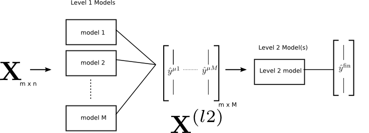
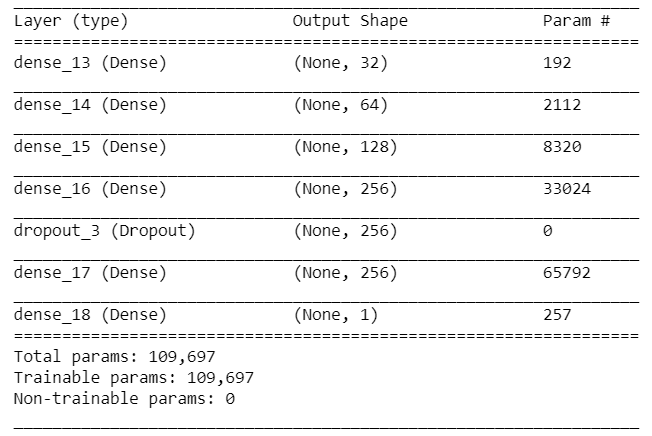
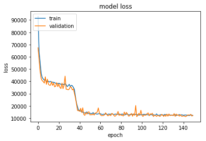

<!-- PROJECT SHIELDS -->
[![Build Status][build-shield]]()
[![Contributors][contributors-shield]]()
[![MIT License][license-shield]][license-url]
[![LinkedIn][linkedin-shield]][linkedin-url]

# Stacking Classifier For GHI Prediction

This repository contains python code for building a staking classifier of FDN and Xgboost for GHI Prediction.

## Stacking
Stacking is an ensemble learning technique to combine multiple classification models via a meta-classifier. The individual classification models are trained based on the complete training set; then, the meta-classifier is fitted based on the outputs -- meta-features -- of the individual classification models in the ensemble. The meta-classifier can either be trained on the predicted class labels or probabilities from the ensemble.

## Results
Using the one FDN with 12 Xgboosts the RSME was tremendiously decresed from **106.46** to **10.11** and keeps on increase one incresing the number of classifier. [here](https://github.com/orionpax00/weather/blob/cnnlstm/solar_radiation_prediction_ensemble/src/models/Stacked_classifier_dnn_xgboost.ipynb)

## Model Architecture and Parameters
### Xgboost
Parameter | Value
--- | ---
learning_rate|0.4
base_score|0.5 
max_depth|8
n_estimators|10
booster|gbtree 
objective|reg:linear

### Deep Neural Network

## Training

<!-- LICENSE -->
## License

Distributed under the MIT License. See `LICENSE` for more information.

<!-- CONTACT -->
## Contact

Durgesh - [@ce.iitr.ac.in](https://orionpax00.github.io) - dkuamr@ce.iitr.ac.in

Project Link: [https://github.com/orionpax00/weather](https://github.com/orionpax00/weather)

<!-- MARKDOWN LINKS & IMAGES -->
[build-shield]: https://img.shields.io/badge/build-passing-brightgreen.svg?style=flat-square
[contributors-shield]: https://img.shields.io/badge/contributors-1-orange.svg?style=flat-square
[license-shield]: https://img.shields.io/badge/license-MIT-blue.svg?style=flat-square
[license-url]: https://choosealicense.com/licenses/mit
[linkedin-shield]: https://img.shields.io/badge/-LinkedIn-black.svg?style=flat-square&logo=linkedin&colorB=555
[linkedin-url]: https://linkedin.com/in/othneildrew
[product-screenshot]: https://raw.githubusercontent.com/othneildrew/Best-README-Template/master/screenshot.png
